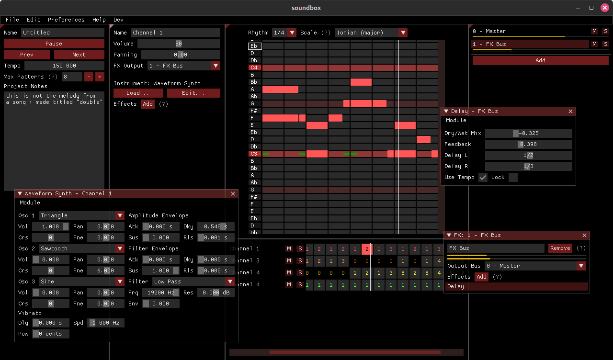
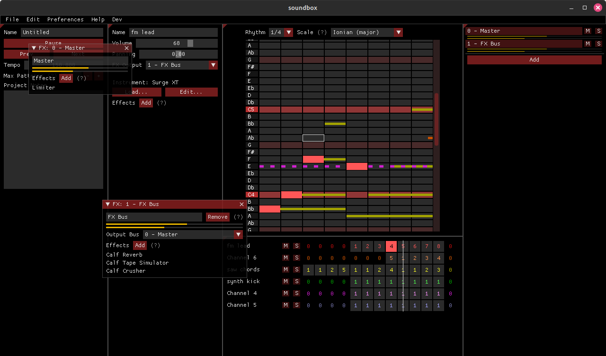
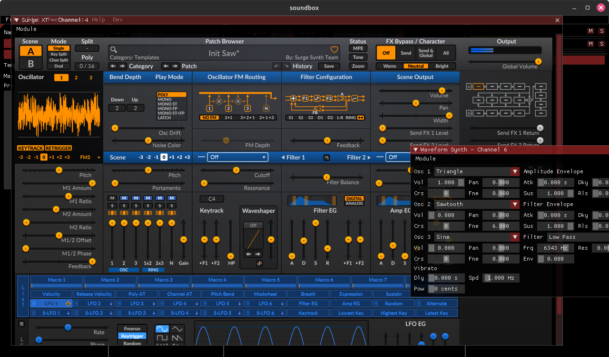

# Screenshots
At the time these were made, these were taken in the lv2 branch. Currently, I have
LV2 support disabled in the main branch because it's a bit unstable.

(Surge XT's UI is quite big, so it doesn't fit well into the 1280x720 window. Hence, the scrollbar)